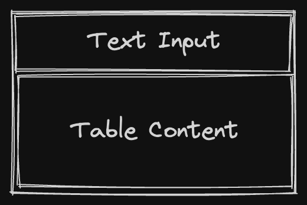
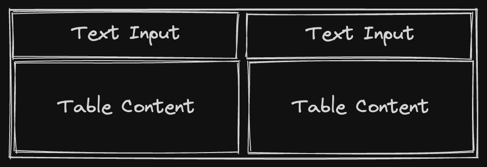
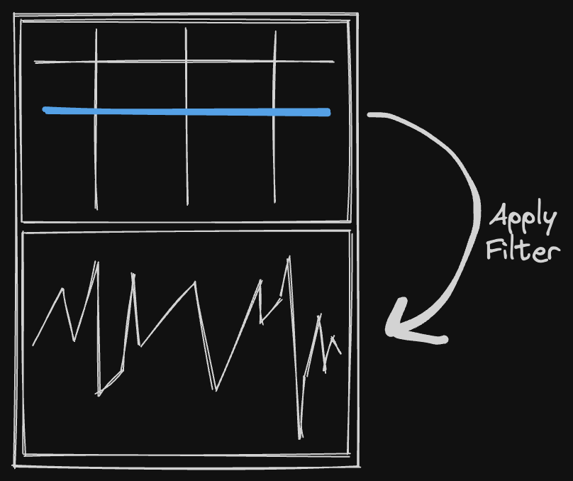
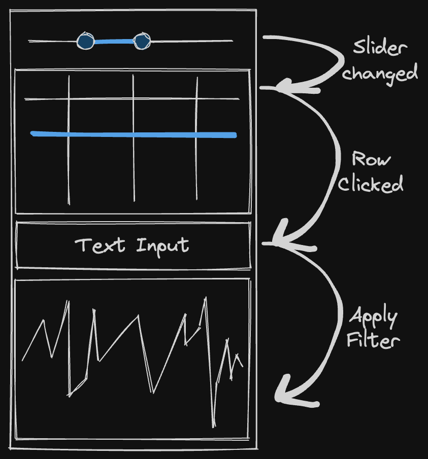

# Programmatic Layouts and Callbacks

- Mock out some ideas of how to code up programmatic layouts and callbacks
- Break it down into a couple parts:
  - UI Primitives and Callbacks: Creating inputs in the UI and that kind of thing to control tables and what not. Things are just laid out automatically in the client.
  - Programmatic Layouts: Define how to lay out all the components using programmatic layouts

## Other Solutions/Examples

### Parameterized Query

```groovy
import io.deephaven.query.parameterized.ParameterizedQuery
import io.deephaven.query.parameterized.Parameter

myQuery = ParameterizedQuery.create()
  .with(Parameter.ofLong("low").inRange(0, 20).withDefault(5))
  .with(Parameter.ofLong("high").inRange(0, 20).withDefault(15))
  .willDo({scope ->
    def low = scope.getLong("low")
    def high = scope.getLong("high")
    def tableResult = db.t("LearnDeephaven", "StockTrades")
    .where("Date=`2017-08-25`", "Size<=$high", "Size>=$low")
    plotResult = plot("Stuff", tableResult, "Timestamp", "Last").show()
    scope.setResult("tableResult", tableResult)
    scope.setResult("plotResult", plotResult)
  }).build()
```

##### Pros

- Already works
- Scope is defined, and re-runs the whole scope when any param changes
- Easy to understand

##### Cons

- Lots of boilerplate
- Syntax easy to get incorrect
- Lots of strings
- No python
- No specifying different contexts (shared PPQ among sessions/users for example)
- No composability - cannot re-use PPQs within PPQs, or define a "component" that gets used

### Callbacks with decorators (plotly, Shiny for python)
```python
from dash import Dash, html, dcc, Input, Output
app = Dash(__name__, external_stylesheets=external_stylesheets)
app.layout = html.Div([
  dcc.RangeSlider(0, 20, 1, value=[5, 15], id='my-range-slider'),
  html.Div(id='output-container-range-slider')
])
@app.callback(
  Output('output-container-range-slider', 'children'),
  [Input('my-range-slider', 'value')])
def update_output(value):
  return 'You have selected "{}"'.format(value)
if __name__ == '__main__':
  app.run_server()
```
Other examples: https://shiny.posit.co/py/docs/overview.html

##### Pros
- Decorators are nice "magic"

##### Cons
- Lots of strings need to match, easy to make a mistake
- Difficult to visualize
- Not sure how to iterate
- Need to have an object named `app`, so not really "composable"

### Streamlit (re-runs entire script on any change)

```python
import streamlit as st
x = st.slider('x')
st.write(x, 'squared is', x * x)
@st.cache # tells streamlit to memoize this function though
def expensive_computation(a, b):
  time.sleep(2) # This makes the function take 2s to run
  return a * b
a = 2
b = 21
res = expensive_computation(a, b)
st.write("Result:", res)
```

##### Pros
- Can use the values easily anywhere in your script
- Entire script re-runs with any change, easy to understand, easy to iterate

##### Cons
- Re-running everything can be costly, need to be conscious with caching/memoization
- Does not achieve composability


## Proposed Syntaxes

### Interactive Query

Early prototype: https://github.com/mofojed/deephaven-plugin-interactive
UI: https://github.com/mofojed/deephaven-js-plugins/tree/interactive

#### Basic Example

Creates a table that simply updates with the value of the slider.

```python
from deephaven.plugin.interactive import make_iq, dh
from deephaven import empty_table

def my_func(x, a):
    print("x is now " + str(x))
    t = empty_table(1).update_view([f"x={x}"])
    return { 't': t }

my_query = make_iq(my_func, x=dh.slider(22, 2, 111))
```

#### Plotting Example

Create two plots showing a sine function and cosine function with the values set from the slider.

```python
from deephaven.plugin.interactive import make_iq, dh
from deephaven import empty_table
from deephaven.plot.figure import Figure

def sin_func(amplitude, frequency, phase):
    # Note: Should use QST to create filters instead of f-strings?
    t = empty_table(1000).update_view(["x=i", f"y={amplitude}*Math.sin(x*{frequency}+{phase})"])
    f = Figure().plot_xy(series_name="Series", t=t, x="x", y="y").show()
    return { 't': t, 'f': f }

def cos_func(amplitude, frequency, phase):
    t = empty_table(1000).update_view(["x=i", f"y={amplitude}*Math.cos(x*{frequency}+{phase})"])
    f = Figure().plot_xy(series_name="Series", t=t, x="x", y="y").show()
    return { 't': t, 'f': f }

inputs = {'amplitude': dh.slider(1), 'frequency': dh.slider(1), 'phase': dh.slider(1)}

iqs = make_iq(sin_func, **inputs)
iqc = make_iq(cos_func, **inputs)
```

##### Pros

- No magic strings (though does have dictionary keys for kwargs)
- Scope is defined, and re-runs the whole scope when any param changes
- Easy to understand
- Should be "easy" to implement once bidirection plugins are completed

##### Cons

- Not clear how to "chain" inputs (e.g. slider based on a table based on another input control, reacting to a click within a table)... unless nesting functions is allowed

### React-like syntax

Use "React hooks" like inspired syntax to write blocks that "re-render" when state changes. **Note**: These examples are just mockups for illustrating the proposed syntax. They may not actually compile.

#### Components (for composability)

Using a "React-like" syntax, it is possible to define "components" which can be re-used and compose other components. For example, we may want to make a "filterable table" component, that just provides a text input field above a table that you can use to filter a specific column in the table. 



Read about [React](https://react.dev/learn) and [React Hooks](https://react.dev/reference/react) if you are unfamiliar with them for a primer on the design principles followed. Here is an example of a proposed syntax for that:

```python

import deephaven.ui as ui

# @ui.component decorator marks a function as a "component" function
# By adding this decorator, wraps the function such that "hooks" can be used within the function (effectively similar to `React.createElement`). Hooks are functions following the convention `use_*`, can only be used within a `@ui.component` context
@ui.component
def text_filter_table(source: Table, column: str):
    # The value of the text filter is entirely separate from the text input field definition
    value, set_value = ui.use_state("")

    # TODO: Should be using QST/filters here instead, e.g. https://github.com/deephaven/deephaven-core/issues/3784
    t = ui.use_memo(lambda: source.where(f"{column}=`{value}`"), [value])

    # Return a column that has the text input, then the table below it
    return ui.flex(
        [
            ui.text_input(
                value=value, on_change=lambda event: set_value(event["value"])
            ),
            t,
        ]
    )
```

The above component, could then be re-used, to have two tables side-by-side:



```python
# Just using one source table, and allowing it to be filtered using two different filter inputs
@ui.component
def double_filter_table(source: Table, column: str):
  return ui.flex([
    text_filter_table(source, column),
    text_filter_table(source, column)
  ], direction="row")
```

#### Table Actions/Callbacks

We want to be able to react to actions on the table as well. This can be achieved by adding a callback to the table, and used to set the state within our component. For example, if we want to filter a plot based on the selection in another table:



```python
import deephaven.ui as ui

@ui.component
def table_with_plot(source: Table, column: str = "Sym", default_value: str = ""):
    value, set_value = ui.use_state(default_value)

    # Wrap the table with an interactive component to listen to selections within the table
    selectable_table = ui.use_memo(
        lambda: interactive_table(
            t=source,
            # When data is selected, update the value
            on_row_clicked=lambda event: set_value(event["data"][column]),
        ),
        [source],
    )

    # Create the plot by filtering the source using the currently selected value
    p = ui.use_memo(
        lambda: plot_xy(
            t=source.where(f"{column}=`{value}`"), x="Timestamp", y="Price"
        ),
        [value],
    )

    return ui.flex([selectable_table, p])
```

#### Putting it all together

Using the proposed components and selection listeners, you should be able to build pretty powerful components, and subsequently dashboards. For example, we could build a component that has the following:
- Dual range slider for specifying the "Size" of trades to filter on
- Table showing only the filtered range
- Text input to filter a specific Sym for a plot derived from the table
- Double clicking a row within the table selects that Sym and updates the text input to reflect that



```python
import deephaven.ui as ui
import deephaven.plot.express as dx

@ui.component
def stock_widget(source: Table, column: str = "Sym"):
    lo, set_lo = use_state(0)
    hi, set_hi = use_state(10000)
    sym, set_sym = use_state("")

    # Create the filtered table
    filtered_table = ui.use_memo(
        lambda: source.where([f"Price >= {lo} && Price <= {hi}"]), [lo, hi]
    )

    p = ui.use_memo(
        lambda: dx.line(filtered_table.where(f"Sym=`{sym}`"), x="Timestamp", y="Last"),
        [filtered_table],
    )

    def handle_slider_change(event):
        set_lo(event.value.lo)
        set_hi(event.value.hi)

    return ui.flex(
        [
            # Slider will update the lo/hi values on changes
            ui.range_slider(
                lo=lo, hi=hi, min=0, max=10000, on_change=handle_slider_change
            ),
            # Wrap the filtered table so you can select a row
            ui.interactive_table(
                t=filtered_table,
                # Update the Sym value when a row is selected
                on_row_clicked=lambda event: set_sym(event["data"][column]),
            ),
            # Text input will update the sym when it is changed, or display the new value when selected from the table
            ui.text_input(value=sym, on_change=lambda event: set_sym(event["value"])),
            # Plot will be filtered/updated based on the above logic
            p,
        ]
    )
```

#### Scoping/Contexts

With Parameterized Queries, scope of the query is limited to a particular session. However, it would be interesting if it were possible to share a context among all sessions for the current user, and/or share a context with other users even; e.g. if one user selects and applies a filter, it updates immediately for all other users with that dashboard open. So three cases:

1) Limit to a particular session (Paramterized Queries, should likely be the default)
2) Limit to the particular user (so if you have the same PQ open multiple tabs, it updates in all)
3) Share with all users (if one user makes a change, all users see it)

#### Other Decisions

While mocking this up, there are a few decisions regarding the syntax we should be thinking about/address prior to getting too far along with implementation.

##### Module name

The above examples use `deephaven.ui` for the module name. Another option would be `deephaven.layout`, but I thought this might get confusing with Golden Layout already existing.

##### Structuring imports

In the above example, there is one simple import, `import deephaven.ui as ui`. From there you just call `ui.component`, `ui.use_state`, etc.

Another option would be importing items directly, e.g. `from deephaven.ui import component, use_state, range_slider`, etc.

Or we could have some sort of hybrid:
```python
# Use `ui` import for components/elements
import deephaven.ui as ui

# Import hooks `use_` directly from `deephaven.ui`
from deephaven.ui import use_state, use_memo

# ... or even have a separate import for all hooks
import * from deephaven.ui.hooks
```

##### Decorators vs. Render function

In React, it uses the `renderWithHooks` function internally to build a context. That's triggered by the `React.createElement` method, or more commonly via JSX when rendering the elements. Pushing/popping the context is crucial for maintaining the proper state and enabling hooks to work reliably.

In Python, we do not have JSX available (or any such equivalent). The above examples use the `@ui.component` decorator for wrapping a function component:
```python
# Just using one source table, and allowing it to be filtered using two different filter inputs
@ui.component
def double_filter_table(source: Table, column: str):
  return ui.flex([
    text_filter_table(source, column),
    text_filter_table(source, column)
  ], direction="row")

dft = double_filter_table(source, "Sym")
```

Another option would be to require calling an explicit render function, e.g.:
```python
# Just using one source table, and allowing it to be filtered using two different filter inputs
def double_filter_table(source: Table, column: str):
  return ui.flex([
    ui.render(text_filter_table(source, column)),
    ui.render(text_filter_table(source, column))
  ], direction="row")

dft = ui.render(double_filter_table(source, "Sym"))
```

I think the decorator syntax is less verbose and more clear about how to use; especially when rendering/building a component composed of many other components. Calling `ui.render` to render all the children component seems problematic. Marking every possible component as just `@ui.component` is pretty straightforward, and should allow for easily embedding widgets.

Note there was an interesting project for using [React Hooks in Python](https://github.com/amitassaraf/python-hooks). However, it is not recommended for production code and likely has some performance issues. It [inspects the call stack](https://github.com/amitassaraf/python-hooks/blob/main/src/hooks/frame_utils.py#L86) to manage hook state, which is kind of neat in that you don't need to wrap your functions; however that would come at performance costs, and also more difficult to be strict (e.g. requiring functions that use hooks to be wrapped in `@ui.component` - maybe there's other dev related things we want to do in there).